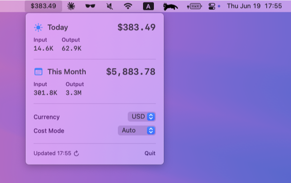

# Claude Code Usage MenuBar

[Claude Code](https://claude.ai/code) の使用統計をリアルタイムで表示する、超高速なネイティブSwift製macOSメニューバーアプリケーションです。



## 💡 これは何？

このアプリはローカルのデータファイルを読み取ってClaude Codeの使用状況を監視し、以下を表示します：
- **日別/月別コスト** - Claude Codeにいくら使ったか
- **トークン使用量** - キャッシュ統計付きの入力/出力トークン
- **リアルタイム更新** - macOSメニューバーでライブ監視

Claude Codeの使用状況を追跡し、コストを効率的に管理するのに最適です！

## ✨ 機能

- **🚀 超高速パフォーマンス**: 0.57秒でロード（最適化前は15秒以上）
- **⚡ スマートキャッシング**: 即座の更新のための2レベルキャッシュシステム
- **💰 リアルタイム監視**: ローカルデータファイルからClaude Code使用状況を追跡
- **🎯 最小フットプリント**: メモリ使用量が少ないネイティブSwiftアプリ（~25MB）
- **🔄 モダンUI**: SwiftUI MenuBarExtraで構築（macOS 13.0以降）
- **💸 正確なコスト追跡**: LiteLLM価格設定で日別・月別コストを表示
- **🌍 通貨変換**: OS自動検出で33以上の通貨へのリアルタイム変換
- **📊 トークン表示**: スマートフォーマットの入力/出力トークン数
- **⏰ 自動更新**: 設定可能な更新間隔（デフォルト：60秒）
- **📈 高度なキャッシング**: 全CPUコアを使用した並列処理

## 📦 インストール

### ビルド済みリリースをダウンロード（推奨）

1. [GitHub Releases](https://github.com/Saqoosha/ccusage-menubar/releases)から最新リリースをダウンロード
2. `Claude-Code-Usage-v*.zip`を解凍
3. `Claude Code Usage.app`をアプリケーションフォルダに移動
4. **重要**: アプリはまだコード署名されていないため、Gatekeeperをバイパスする必要があります：
   
   **オプション1 - ターミナル（推奨）:**
   ```bash
   xattr -cr /Applications/Claude\ Code\ Usage.app
   ```
   
   **オプション2 - システム設定:**
   - アプリをダブルクリックしてセキュリティ警告をトリガー
   - システム設定 > プライバシーとセキュリティ に移動
   - ブロックされたアプリメッセージの横にある「このまま開く」をクリック

5. アプリを起動し、メニューバーにコスト表示（例：¥0）を探してください

### ソースからビルド

```bash
# リポジトリをクローン
git clone https://github.com/Saqoosha/ccusage-menubar.git
cd ccusage-menubar

# アプリケーションフォルダにインストール
./scripts/install.sh

# またはアプリをビルドするだけ
./scripts/build.sh

# または開発モードで実行
./scripts/dev.sh run
```

詳細なビルド手順については、[docs/BUILD.md](docs/BUILD.md)を参照してください。

## ⚡ なぜこんなに速い？

- **ネイティブSwift**: macOS専用に構築、ウェブアプリではない
- **スマートキャッシング**: 前のデータを記憶するので、すべてを再読み込みしない
- **並列処理**: すべてのCPUコアを同時に使用
- **効率的なファイル読み取り**: 新しいまたは変更されたファイルのみを処理

結果：数ヶ月分の使用履歴があっても、1秒以内にロード！

## 📁 プロジェクト構造

```
ccusage-menubar/
├── README.md                    # プロジェクト概要
├── README.ja.md                 # 日本語README（このファイル）
├── CLAUDE.md                    # Claude Code設定
├── Package.swift                # Swiftパッケージマニフェスト
├── Info.plist                   # macOSアプリバンドル設定
├── Sources/ClaudeUsageMenuBar/  # メインアプリケーションソースコード
├── Tests/                       # テストスクリプトとSwiftユニットテスト
├── docs/                        # ドキュメントファイル
│   ├── BUILD.md                 # ビルド手順
│   ├── OPTIMIZATION_RESULTS.md  # パフォーマンス実績
│   ├── CURRENCY_CONVERSION.md   # 通貨変換機能の詳細
│   └── ...                      # その他のドキュメント
├── benchmarks/                  # パフォーマンスベンチマークとCLIツール
│   ├── benchmark*.swift         # パフォーマンステストスイート
│   ├── exact_ccusage.swift      # リファレンス実装
│   └── ...                      # 開発ツール
├── tests/                       # テストスクリプトと検証ツール
│   ├── compare_json.py          # ccusage CLIとの検証
│   ├── test_*.py                # 各種テストスクリプト
│   └── ...                      # テストユーティリティ
└── artifacts/                   # 生成ファイルとビルド出力
```

## 💻 必要環境

- macOS 13.0（Ventura）以降
- Claude Codeがインストールされ使用されていること（ローカル使用ログを作成）

## 🖱️ 使い方

これは**メニューバーアプリ**です - Dockアイコンなしでバックグラウンドで実行されます：

- **見つけ方**: メニューバー（画面右上）のコスト表示を探す
- **詳細表示**: コストをクリックして日別/月別の内訳を表示
- **終了**: メニューバーアイテムをクリックして「Quit」を選択
- **非表示？**: メニューバーマネージャー（Bartenderなど）を使用している場合は、そこを確認

## 📖 ドキュメント

- [ビルドガイド](docs/BUILD.md) - アプリのビルドとインストール方法
- [Claude設定](CLAUDE.md) - 開発者向けの技術詳細
- [通貨変換](docs/CURRENCY_CONVERSION.md) - 多通貨サポートの詳細

## 🎯 なぜこのアプリ？

Claude Codeには組み込みの使用状況モニターがないため、コストと使用パターンを追跡するのが困難です。このアプリは以下によって解決します：

1. ✅ **超高速パフォーマンス** - 1秒以内に使用データをロード
2. ✅ **ネイティブSwift実装** - 軽量で応答性の高いmacOS体験
3. ✅ **正確なコスト計算** - 実際のLiteLLM価格データを使用
4. ✅ **リアルタイム更新** - メニューバーに現在の使用状況を即座に表示
5. ✅ **高度なキャッシング** - 最高のパフォーマンスのためのスマートな2レベルキャッシュ

## 🔍 仕組み

アプリは`~/.claude/projects/`に保存されているClaude Codeのローカル使用ログを読み取り、処理して以下を表示します：
- トークン数（入力/出力/キャッシュ）
- 日別および月別のコスト計算
- リアルタイム通貨変換（33以上の通貨サポート）
- 使用パターンとトレンド

すべての処理はローカルで行われます - 為替レートの取得以外、データはどこにも送信されません！